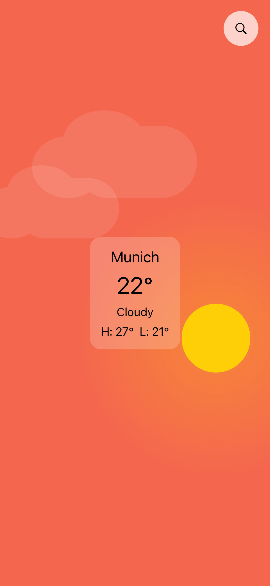
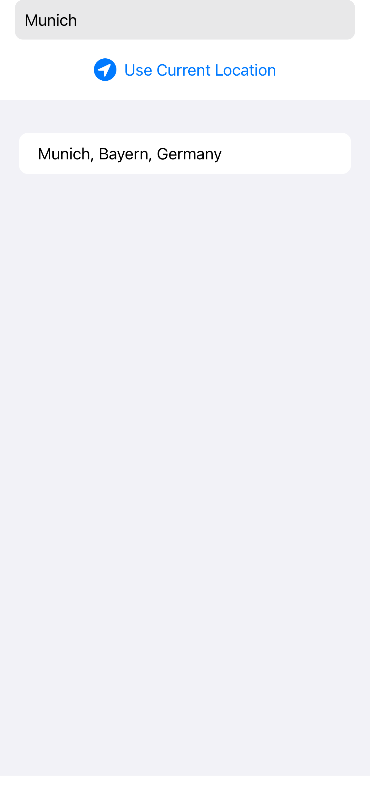
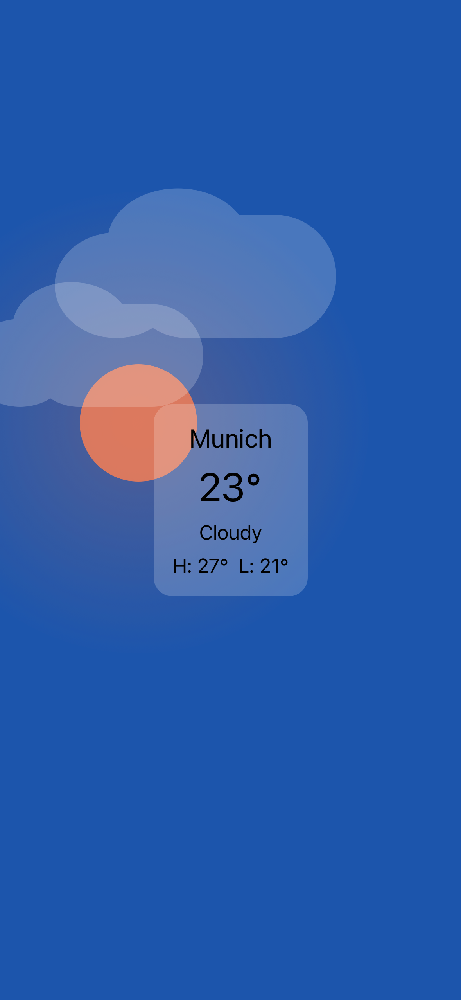
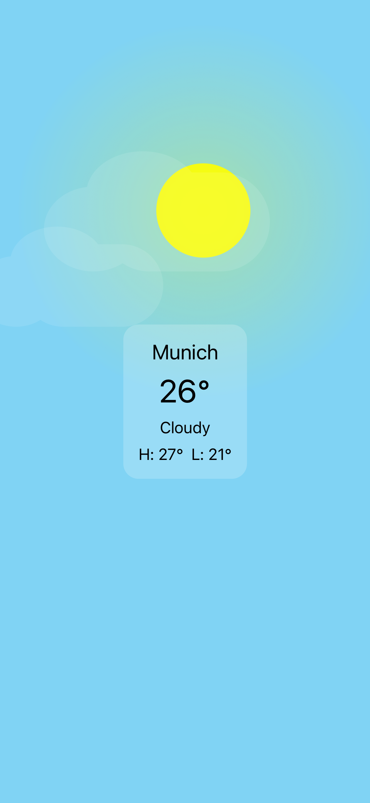
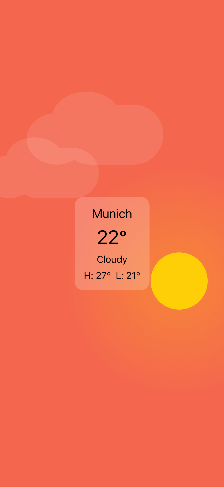
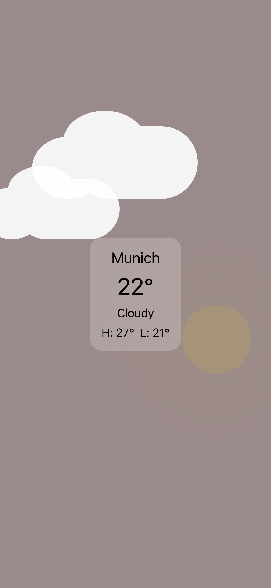

# WeatherApp
First, it took me a bit more time than I expected :) 
But it became so interesting I decided to put an extra effort into the project

## Additional points
- [x] SOLID being followed 
- [x] README
- [x] Test coverage (83.6%)
- [x] Dark/Light (No extra effort needed for SwiftUI)
- [x] Forecast react on location change (the filtered distance is 5km and works only when current location is chosen)
- [ ] Supporting multiple temperature units (Networking layer has it, although I didn't manage to include it to the presentation layer)

## User Interface

| Screen                                                                                                                          | Description                                                                                                                                                                                                                                                                                          |
|---------------------------------------------------------------------------------------------------------------------------------|------------------------------------------------------------------------------------------------------------------------------------------------------------------------------------------------------------------------------------------------------------------------------------------------------|
|                   | The main screen actually adjusts to the current time and changes the color of the sky, position of the sun and even takes the cloud percentage to adjust the opacity of the clouds on the screen. Transition to the location search screen happens by pressing "search" icon in the top right corner |
|  | Location search is pretty basic screen with just a textfield for search, use current location button and the list of available locations that match the request                                                                                                                                      |

| Morning                                                                                                              | Noon                                                                                                           | Evening                                                                                                              | Cloudy evening                                                                                                                    |
|----------------------------------------------------------------------------------------------------------------------|----------------------------------------------------------------------------------------------------------------|----------------------------------------------------------------------------------------------------------------------|-----------------------------------------------------------------------------------------------------------------------------------|
|  |  |  |  |

## Stack
- SwiftUI with MVVM for presentation layer
- Clean architecture and generic networking layer
- async await for the networking layer, Combine (obviously) for presentation layer
- Auto-generated mocks, DI Container, Snapshot tests

## Tests
Here I have 2 trade-offs I had to make in order to accomplish the task:
1. Since somehow SwiftUI was appearing through `WeatherApp` I had to disable `onAppear` logic for unit tests specifically
2. Just for a demo and a better code coverage `CurrentWeatherViewModel` is tested although easier one - `LocationSearchViewModel` isn't.

The whole networking layer is tested. Therefore, code coverage is **83.6%** only. 

## References
I've used following articles to get inspired by:
- [Generic network layer](https://betterprogramming.pub/async-await-generic-network-layer-with-swift-5-5-2bdd51224ea9)
- [Clean architecture for networking layer](https://paulallies.medium.com/clean-architecture-in-the-flavour-of-swiftui-5-5-8430786a83)

## Packages
- [Mockolo](https://github.com/uber/mockolo) - auto-generated Mocks by Uber with Spy method that helps to track down amount of calls
- [Factory](https://github.com/hmlongco/Factory) - DI manager
- [Swift Snapshot testing](https://github.com/pointfreeco/swift-snapshot-testing) - library for make it easy to have snapshot tests 
